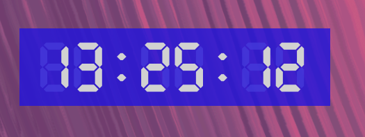

# Desktop Clock

A customizable desktop clock application built with PyQt5.



## Features

- Displays current time in digital format
- Customizable font, color, and size
- Frameless window option for a sleek look
- Adjustable background transparency
- Drag-and-drop functionality for easy repositioning
- Settings window for easy customization

## Requirements

- Python 3.6+
- PyQt5
- PyYAML

## Installation

1. Clone this repository:
```sh
git clone https://github.com/m7kn/clock.git
```

2. Create and activate virtual env:
```sh
python -m venv venv
source venv/bin/activate
```

3. Install the required packages:
```sh
pip install -r requirements.txt
```

## Usage

Run the main.py file to start the application:
```sh
python main.py
```
Right-click on the clock to access the context menu, where you can open the settings, view information about the app, or exit.

## Configuration

The application uses a YAML configuration file (`config.yaml`) to store settings. If the file doesn't exist, default settings will be used and a new configuration file will be created.

You can customize the following settings:

- Main Window:
  - Frameless mode
  - Background color
  - Window position and size

- Clock:
  - Font and font size
  - Text color
  - Background color
  - Show/hide seconds
  - Horizontal and vertical padding

## Contributing

Contributions are welcome! Please feel free to submit a Pull Request.


