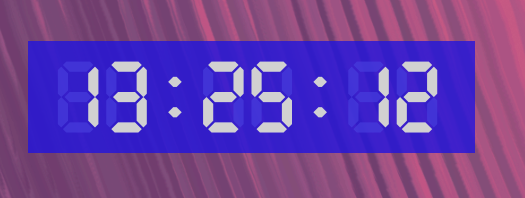
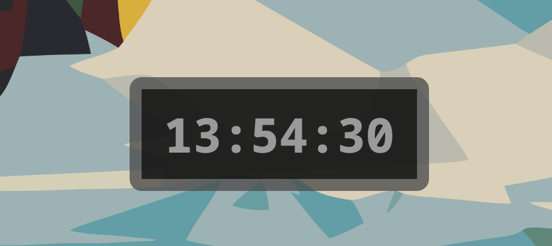
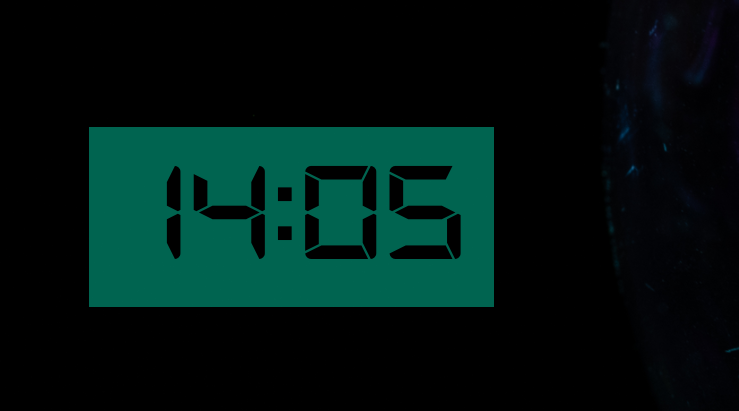
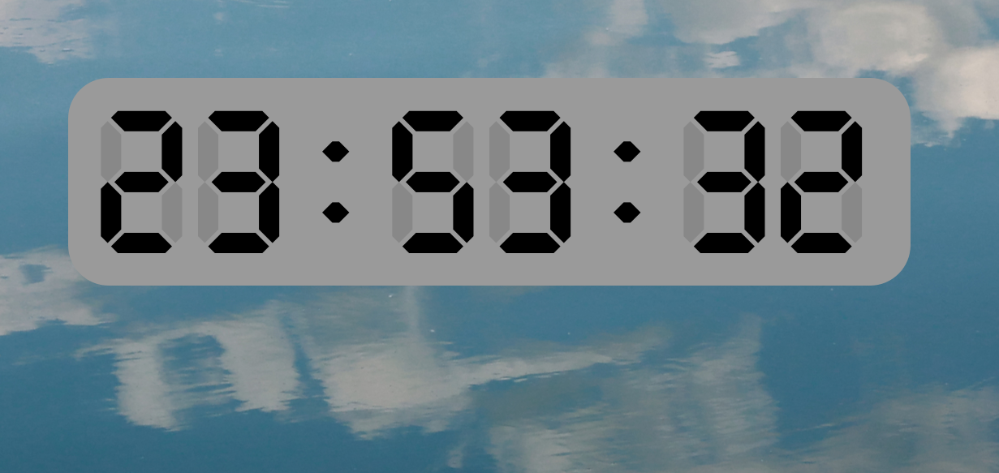

# Desktop Clock Application
Version: 0.2

A simple yet customizable desktop clock application built with PyQt5.

## Screenshots










## Features
- Digital clock display
- Customizable font and size
- Adjustable colors (clock text and background)
- Adjustable transparency
- Frameless mode
- Optional seconds display
- Corner rounding adjustment
- Modern settings window

## Installation
1. Clone the repository:
```sh
git clone https://github.com/your-username/desktop-clock.git
```
2. Enter the project directory:
```sh
cd desktop-clock
```
3. Optional: create a virtual environment:
```sh
python -m venv venv
source venv/bin/activate
```
4. Install required dependencies:
```sh
pip install -r requirements.txt
```

## Usage
Run the `main.py` file:
```sh
python main.py
```

## Settings
The application can be customized through the "Settings" option in the context menu, accessible by right-clicking. Settings include:
- Clock font and size
- Clock text color and background color
- Seconds display
- Frameless mode
- Horizontal and vertical padding
- Main window background color
- Corner rounding amount

## Developer Notes
- Settings are stored in a YAML file
- The application supports custom fonts
- Color picker buttons now display the selected color's hex code
- Settings window has a modern design with improved appearance and usability

## Contributing
If you'd like to contribute to the project, please open an issue or send a pull request.